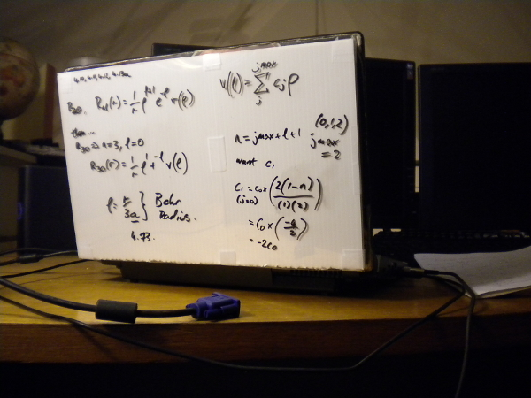

(in the spirit of
 [https://github.com/samsquire/ideas](https://github.com/samsquire/ideas).)

various ideas and projects
==

these are ideas i'd like to work on, or just things i'd like to see done. if
you complete one of these things, or know some similar software, feel free to
fork and update and issue a pull request!

# incomplete

  1. **movie plot characterisation by graphs**

    this could tell you how complicated the plot is by how many nodes in the
    graph, and so on.

  1. **rotated vim screen based on head position**

    it could adjust text heights to make it appear as if you were always staring
    at it head-on. 

  1. **the inequaliser**

    takes some given equation and considers all the possible inequalities they
    could be used on it.

  1. **programming art workshopy thing**

    a place where you can go and sit and program or do art or whatever. like a
    library. would be a large open space.

  1. ***do*-calculus in networkx**

    implement Judea Pearls *do*-calculus in networkx.

  1. **mathematical property browser**

    suppose you have some object; you'd like to find out what you can do with
    it. for example, you might have a 'simple function'. then it could be
    measureable, say, in the context of measure theory, and so on.

    can generalise to finding various theorems (and lemmas, etc) that could be
    used in certain scenarios. should be easy to use; not at the level of
    proof assistants.

  1. **ambient sound interpreter**

    takes input from the local radio waves, converts them into sound via some
    pattern matching radom strategy. it should be possible to modify, based on
    mood, but it should also sound sufficiently unique as to be interesting.

  1. **stay up to date with specific authors**

    There are a couple of things to do this already.
    * [scirate](http://www.scirate.com/)
    * [google scholar alerts](http://scholar.google.com.au/)

    I also wrote [arxiv-checker](http://arxiv-checker.herokuapp.com/). I'm not
    sure if any of these is perfect, though. arxiv-checker is limited in only
    checking arxiv, and also in the number of people and at the moment only
    does a month back in time. google scholar occasionally gets it wrong (i
    get sent alerts when the author didn't actually publish the paper), and 
    scirate requires you see the paper pop up.

  1. **git console dashboard**

    at a glance i'd like to see the status of all my repos; the
    outgoing/incoming changes from various upstream sources, etc; then i could
    issue system-wide updates and so on.

    there appear to be a few things like this, but are gui-based.

  1. **note from self**

    a thing which reads your comments for 'note to self' and then randomly
    tells you about these things.

    by 'comments' i mean any comment anywhere. for example, this app could
    exist as a skype bot, that joins in on your skype conversations; or
    alternatively it might go through all your source code, or wherever you
    write these things.

    i think it might be best if it responds back in a few ways; i was thinking
    that it could randomly send a message to your terminal, or again with the
    skype thing, it could randomly send you a message.

  1. **lift reading/writing**

    all lifts could contain fixed whiteboard markers; then you could write on
    them if you wanted.

  1. **creative idea generator**

    it should be possible to have a program that generates creative ideas on a
    given topic. as a first pass it should be able to generate other
    'random-combination' based ideas that i've thought of; much like the 'lift
    reading/writing' above.

  1. **programmers keyboard**

    there are many ideas like this, but i'm not sure which one i like best. a
    custom key layout? an actual physical keyboard? a supplemental keyboard to
    the typical one? a modal keyboard?

    one idea is to add a new row of keys. This new row would feature specific
    keys for characters such as: ! ? * < > ( ) { } . " : + & | .

    This list could possible be configured for different languages, as some
    wouldn't require those characters, and may want different ones (for
    example Python, or some form of assembly).

    But at least it may save us from constantly pressing shift, and it may be
    interesting to see if it can lead to other possible benefits; i.e. what
    other buttons could be implemented and considered. It may be interesting
    to consider a 'build' button, or attach some macros to 'programmable'
    buttons. It is already known that [programmable](http://www.artlebedev.com/everything/optimus/) 
    keyboards exist, so maybe they are the answer; but they are very
    expensive.

    maybe this can all be solved by vim configurations, though (as with many
    of lifes problems).

# complete

  1. **laptop whiteboard**

    a whiteboard attached to your laptop.

    
    

    you require only melamine, or some similar material, and velcro dots.
    pictured is some transparency paper stuck on a piece of corregated
    plastic. i've found the melamine purchased from a shop tends to not clean
    as nicely as the whiteboards you find at universities; i'm not sure why.
    recommend using these with the thin-tipped whiteboard markers.
